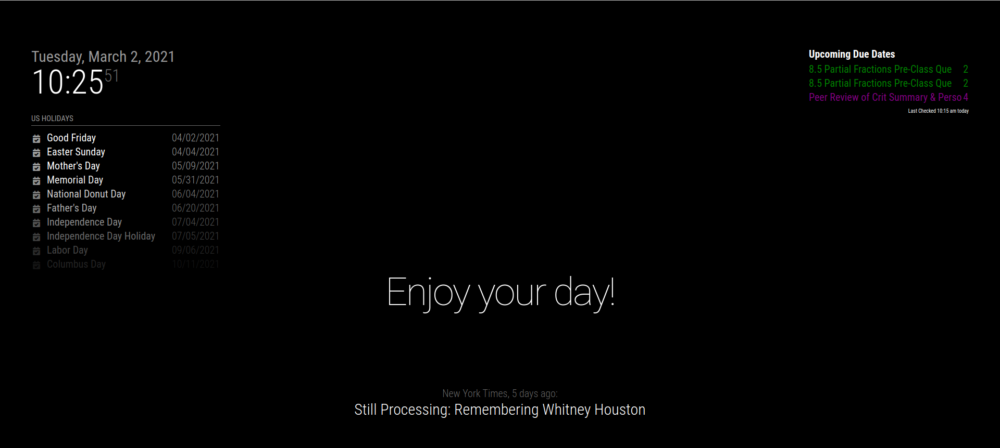

# MagicMirror School Loop
This is a module for `MagicMirror²` which displays upcoming assignments from the School Loop LMS. The School Loop LMS is used by middle schools, high schools and other institutions for coursework.

## Installation
1.  Clone this repository into your MagicMirror `modules` folder.
```
cd /home/pi/MagicMirror/modules
git clone https://github.com/child-duckling/MMM-SchoolLoop.git
```
2.  Edit your configuration file under `config/config.js` with the following configuration.
```
{
  module: "MMM-Canvas",
  position: "top_right",
  config: {
    colors: ["blue", "red",],
    user: {
        username: "user",
        password: "pass",
    },
    subdomain: "onlinelearning",
    assignMaxLen: 35,
    assignToDisplay: 3,
  }
},
```
4. Input the correct School Loop subdomain in `subdomain`. 
```
iamaschool.schoolloop.com
^^^^^^^^^^
Subdomain
```
5. Change `user` to the username you use to access School Loop
6. Change `pass` to the password you use to access School Loop
> Note: Your username and password are stored **LOCALLY** in `config/config.js`. They are **ONLY** used to access your institution's School Loop instance. School Loop's API or lack there of is READ only unless you want to send Loopmails from a mirrior (why?) 


7. (Optional) To color code the courses, put in colors in the colors array in the corresponding order with the courses array. This array accepts all CSS color values [CSS Colors](https://www.w3schools.com/colors/default.asp). I reccomend using the color names for clarity.
8. (Optional) assignMaxLen will keep assignments from displaying too long, and assignToDisplay changes the number of upcoming assignments to show.
### Preview



#### Credits

MagicMirror²:   [MagicMirror²](https://github.com/MichMich/MagicMirror)   


Based heavily on the MMM-Lice (Live International Currency Exchange) module by mkyle1
MMM-LICE:    [MMM-LICE](https://github.com/mykle1/MMM-LICE)

School Loop API:


Break:  [Break](https://github.com/saagarjha/break)


OpenLoop [OpenLoop](https://schoolloop.com/pf4/cms2/view_page?d=x&group_id=1516954809004&vdid=i7fcm1t7v9bh4)
